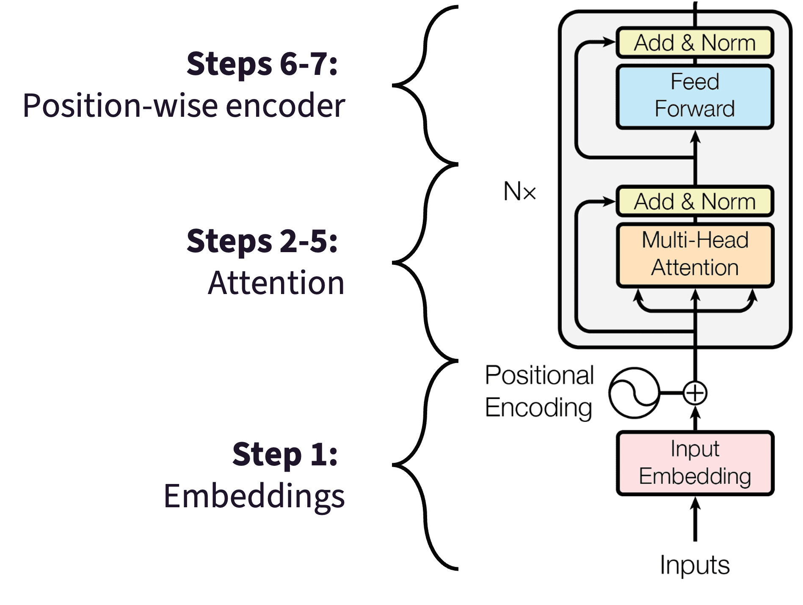

# Pen-and-Paper Exercise: One-layer Transformer (Encoder-only)

> [!INFO] Overview
> **Task:** Compute the output of the one-layer transformer
>
> **Input Sentence**: "My model overfit again"
>
> **Output**: Contextualized embeddings for each token.

**Note:** Feel free to use the online calculators for vector-matrix multiplications: [Online Calculator](https://matrix.reshish.com/matrix-multiplication/).

## Architecture

We will go through the one-layer BERT flow:



Our model has already been pretrained. We will use a **slightly simplified** BERT architecture:

1. We use word embeddings instead of wordpieces (e.g., our tokenizer does not split "overfit" into ``['over'] ['##fit']``)
2. We do not use normalization layers (which rescale tensors inside of the encoder)
3. We drop the output projection $W_O$ that a tansformation  applies after the weighted sum (in Step 4).
4. Our vocabulary has only 11 tokens.

## Steps

### Step 1: Compute embeddings

#### Token Embeddings

| Token | Embedding |
| --- | --- |
| a | (0,1,4) |
| again | (2, -1, 1) |
| converges | (-1, 2, 0) |
| crashed | (-2, 0, 3) |
| her | (1, -1, 1) |
| model | (0, 1, 1) |
| my | (1, 0, 1) |
| network | (-1, 0, -1) |
| overfit | (1, 1, 0) |
| the | (-1, 0, 0) |
| yesterday | (-2, 1, 2) |

#### Positional Embeddings

| position | positional embedding |
| --- | --- |
| 1 | (0, 0, 0) |
| 2 | (1, 0, -1) |
| 3 | (0, 1, 1) |
| 4 | (-1, 1, 1) |
| 5 | (-2, 1, 1) |

**Subtask**: Compute ``embedding + positional embedding`` for each token.

```
X(my)      = ____________
X(model)   = ____________
X(overfit) = ____________
X(again)   = ____________
```

### Step 2: Project to Q, K, V

This is where our embeddings enter the attention block: the part of the encoder where tokens pass information between each other.

Our attention layer has only one attention head:

$$
W_Q = \begin{bmatrix} 1 & 0 & 1 \\ 0 & 1 & 0 \\ 1 & 0 & -1 \end{bmatrix}, W_K = \begin{bmatrix} 0 & 1 & 1 \\ 1 & 0 & -1 \\ 1 & 1 & 0 \end{bmatrix}, W_V = \begin{bmatrix} 1 & 1 & 0 \\ 0 & 1 & 1 \\ 1 & 0 & 1 \end{bmatrix}
$$

Each $X(t)$ is a **row** vector, so we multiply it on the *left* of the weight matrix:
$$
Q(t) = X(t)\, W_Q \\
K(t) = X(t)\, W_K \\
V(t) = X(t)\, W_V
$$

**Subtask:**  Compute Q, K, V projections for all four tokens.

```
Q(my)      = ____________
Q(model)   = ____________
Q(overfit) = ____________
Q(again)   = ____________

K(my)      = ____________
K(model)   = ____________
K(overfit) = ____________
K(again)   = ____________

V(my)      = ____________
V(model)   = ____________
V(overfit) = ____________
V(again)   = ____________
```

### Step 3.1: Attention scores

Every query is compared against every key with a **dot product**:

$$
S(i, j) = \frac{Q(i) \cdot K(j)}{\sqrt{d_k}}, \qquad d_k = 3, \quad \sqrt{3} \approx 1.732
$$

**Why divide?** Dot products grow with the dimension of the vectors, and softmax of large numbers saturate.  The $\sqrt{d_k}$ term keeps the scores in a range where attention stays a soft distribution.

**Subtask:** Fill in the 4×4 score matrix (rows = query token, columns = key token).

| | my | model | overfit | again |
| --- | --- | --- | --- | --- |
| my | | | | |
| model | | | | |
| overfit | | | | |
| again | | | | |

### Step 3.2: Normalized Attention Scores

Apply softmax to **each row** of the score matrix to get attention weights (every row should sum to 1):

$$
A(i,j) = \frac{e^{S(i,j)}}{\sum_{k=1}^{4} e^{S(i,k)}}
$$

The sum in the denominator runs over the whole row $i$, that is what makes the row sum to 1.

**Subtask:** Use the [softmax calculator](https://www.redcrab-software.com/en/Calculator/Softmax) to fill in the scores below.

| | my | model | overfit | again |
| --- | --- | --- | --- | --- |
| my | | | | |
| model | | | | |
| overfit | | | | |
| again | | | | |

This will become our final attention matrix $A$.

### Step 4: Context vectors

Now we use $A$ and the value vectors to compute the contextual representation of each word (a weighted sum of value vectors):

$$
\mathrm{C}(i) = \sum_j A(i,j) \cdot V(j)
$$

**Subtask:**  Compute the contextual representations.

```
C(my)      = ____________
C(model)   = ____________
C(overfit) = ____________
C(again)   = ____________
```

### Step 5: Residual connection

We further add the contextualized representations back to the representations that originally entered the encoder:

$$
Z(i) = X(i) + C(i)
$$

**Subtask:** Compute updated representations.

```
Z(my)      = ____________
Z(model)   = ____________
Z(overfit) = ____________
Z(again)   = ____________
```

### Step 6: Position-wise feed-forward network

Attention mixed information *across tokens*. The position-wise layer does the complementary job: it projects each token up into a wider space and back down, letting that token's own dimensions interact. Real BERT expands 768 → 3072 → 768; we go 3 → 4 → 3.

The **same** weights are applied independently to every token's $Z$ vector (this is what "position-wise" means — there is no $i$ index on $W$):

$$
W_{f_1} = \begin{bmatrix} 1 & 0 & -1 & 1 \\ 0 & 1 & 1 & 0 \\ 1 & -1 & 0 & 0 \end{bmatrix}\ (3 \times 4), \quad
W_{f_2} = \begin{bmatrix} 1 & 0 & 1 \\ 0 & 1 & 0 \\ -1 & 1 & 1 \\ 1 & 0 & -1 \end{bmatrix}\ (4 \times 3)
$$

$$
b_1 = [0,0,1,-1], \quad b_2 = [0,0,0]
$$

**Subtask:** Use the weights above to do the following:

$$
F_1(i) = \mathrm{ReLU}\big(Z(i)\, W_{f_1} + b_1\big), \text{ where } \mathrm{ReLU}(x) = \max(0,x)
\\
F_2(i) = F_1(i)\, W_{f_2} + b_2
$$

$F_1(i)$ is 4-dimensional; $F_2(i)$ is back to 3 dimensions.

```
F_2(my)      = ____________
F_2(model)   = ____________
F_2(overfit) = ____________
F_2(again)   = ____________
```

### Step 7: Second residual connection

Finally, we add the result of the position-wise feed-forward network to the previous tensor:
$$
\mathrm{Output}(i) = F_2(i) + Z(i)
$$

**Subtask:** This is the final output of the encoder layer for each of the four tokens.

```
Output(my)      = ____________
Output(model)   = ____________
Output(overfit) = ____________
Output(again)   = ____________
```

## Reference

> Devlin, Jacob, et al. "BERT: Pre-training of deep bidirectional transformers for language understanding." Proceedings of the 2019 conference of the North American chapter of the association for computational linguistics: human language technologies, volume 1 (long and short papers). 2019.
